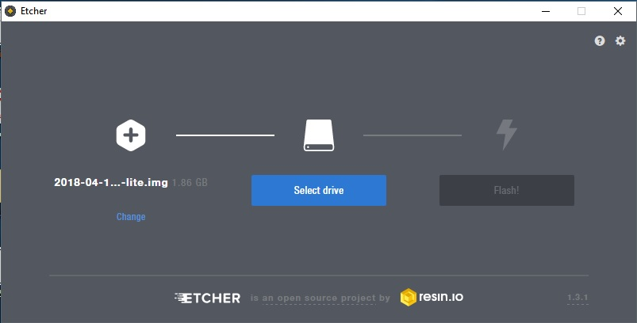

# Minimal Kiosk


|Révision|Date|Modification|Auteur|
|-----|-----|-----|-----|
|1.0|11/06/2018|Création|Valentin MEZIN|

**Sommaire**

<!-- TOC depthFrom:1 depthTo:6 withLinks:1 updateOnSave:1 orderedList:0 -->

- [Minimal Kiosk](#minimal-kiosk)
	- [Présentation](#prsentation)
		- [Minimal kiosk, c'est quoi ?](#minimal-kiosk-cest-quoi-)
		- [Comment ça marche ?](#comment-a-marche-)
		- [Investissement](#investissement)
	- [Tutoriel](#tutoriel)
		- [Pré-requis](#pr-requis)
			- [Raspbian Lite](#raspbian-lite)
			- [Etcher](#etcher)
		- [Première installation](#premire-installation)
		- [Maintenance de l'affichage](#maintenance-de-laffichage)

<!-- /TOC -->

## Présentation
### Minimal kiosk, c'est quoi ?
*Minimal kiosk* est une solution d'affichage dynamique basée sur des Raspberry Pi. La solution a été développée pour le lycée Emmanuel Mounier de Grenoble dans le but de remplacer un système vieillissant.

> Un Raspberry Pi est un micro-ordinateur destiné en premier lieu à l'apprentissage de l'informatique. Ce dernier dispose de tout le nécessaire tels que des ports USB, un port HDMI, un port ethernet et sur les dernières versions d'un récepteur/émetteur Wi-fi.

L'affichage dynamique est défini par un dispositif d'écrans TV affichant des informations diverses. Dans notre cas nous affichons la date, l'heure, la météo et un diaporama d'informations interne.

Les défauts constatés de l'ancien système étaient :
* les écrans TV étaient reliés à de vieux PC de bureau (lents et energivores).
* il fallait allumer et éteindre les ordinateurs tous les jours.
* il fallait manuellement ouvrir le navigateur pour mettre en plein écran un Google Slide.

La solution envisagée a réglé tous ces points :
* un Raspberry Pi est un micro-ordinateur peu consommateur et suffisant pour l'affichage d'un navigateur
* le système d'exploitation nous permet de mettre en place des actions automatisées (par le biais de scripts), aussi bien l'extinction du navigateur que l'extinction du signal vidéo.

*Minimal kiosk* a été développé dans l'optique de dégager les problèmes techniques de l'équation pour se concentrer sur les informations et le moyen de communiquer avec les visiteurs et les élèves du lycée. De même, ayant bien conscience des moyens aujourd'hui restreints en matière de référents informatiques dans les établissements, j'espère que le tutoriel qui suit sera à la portée de tous.

L'autre point important à ne pas négliger réside dans le coût de la solution ! **Le code est libre** et le micro-ordinateur choisi (Raspberry  Pi) coûte à l'unité 35€. C'est une solution peu coûteuse qui peut permettre à votre établissement une certaine indépendance. Vous évitant des frais parfois démesurés quand il s'agit d'affichage dynamique.

### Comment ça marche ?
Votre téléviseur est branché en HDMI (ou avec un adaptateur) à un Raspberry Pi.
Ce dernier est configuré de sorte à afficher automatiquement au démarrage un navigateur web (Chromium) et une page par défaut.

Cette page est disponible en téléchargement sur Github.com ici-même. Cette page est une page web .html.

Elle a également été écrite en Javascript afin d'avoir une mise à jour asynchrone des différents éléments affichés. Pour rappel, l'écran affiche la date et l'heure (mis à jour toutes les secondes), la météo (mise à jour toutes les 30 minutes) et un Google Slide (mis à jour toutes les 5 minutes).

___

**En tant qu'utilisateur vous n'avez besoin de configurer qu'une première fois votre Raspberry Pi. En préciseant l'URL de votre Google Slide et les coordonées GPS de votre établissement pour la météo.**

Ensuite le Raspberry Pi vivra sa vie. Il s'éteindra à l'heure décidée et il se rallumera à l'heure décidée.
Avant chaque vacances vous pouvez débrancher tout simplement le Raspberry Pi; en le rebranchant à la rentrée il lancera automatiquement Chromium.

La solution peut-être considérée comme "stand-alone". C'est-à-dire qu'elle fonctionne d'elle-même et n'est pas reliée à d'autres de telle sorte qu'un eco-système pourrait se créer. La configuration est unique à chaque Raspberry Pi. *Une solution envisagée pour recenser/contrôler les Raspberry Pi serait de créer un serveur NodeJS sur le même réseau.*

### Investissement
Un affichage dynamique vous en coûtera :
* un écran TV
* un Raspberry Pi (35€)
* une carte microSD >= 4Go
* un lecteur de carte microSD
* un câble HDMI
* un chargeur d'alimentation
* un câble ethernet
* un clavier USB
* et un peu de temps !

En imaginant que le Raspberry Pi tournera 24/7, il vous en coûtera 10 fois moins cher en électricité que si vous y aviez mis un ordinateur de bureau (tournant lui 5/7jours et 10 heures par jour...).

---
## Tutoriel
### Pré-requis
Nous allons installer le système d'exploitation (Raspbian) sur notre carte microSD avant de lancer le Raspberry Pi.

#### Raspbian Lite
Raspbian Lite est le système d'exploitation que nous allons utilisé. Dérivé de Debian et optimisé pour Raspberry Pi, la version Lite est dépourvue d'environnement graphique et nous permettra de partir sur une base légère.

1. Téléchargez [Raspbian Lite](https://www.raspberrypi.org/downloads/raspbian/) sur le site officiel.
`Version testée : Stretch 18/04/2018.`

2. Décompressez l'archive zip. Vous allez obtenir une image (.img).
`Exemple : 2018-04-18-raspbian-stretch-lite.img`


#### Etcher
1. Téléchargez [Etcher.io](https://etcher.io/) pour votre OS (macOS / Windows / Linux). Attention à l'architecture CPU (32bits ou 64bits) !
2. Installez Etcher ou lancez-le si vous avec choisi la version portable.
3. Choisissez l'image de Raspbian Lite, choisissez la partition à écrire (carte microSD) et cliquez sur **Flash!**.

4. Retirez la carte microSD et insérez-là dans le Raspberry Pi.
5. Branchez le câble ethernet, le clavier USB et l'écran au Raspberry Pi puis branchez l'alimentation.

---
### Première installation

#### 1. Première étape
Connectez-vous avec le compte par défaut de Raspbian.

Login : `pi`
Password : `raspberry`

*Note: Attention le clavier est en QWERTY !*

#### 2. Clavier
Nous allons changer la disposition des touches sur la clavier (AZERTY) pour plus de facilité.

Tapez : `sudo raspi-config`

Une fenêtre va apparaître, déplacez-vous avez les flèches du clavier et la touche *Entrée* pour valider.

Choisissez : `4. Localisation Options`
Choisissez : `13. Change Keyboard Layout`

Choisissez le clavier par défaut, `Other` (pour faire apparaître les autres langues), choissez `Français` et tout le reste par défaut.

#### 3. Timezone
Nous allons modifier la *timezone* pour que l'heure du Raspberry Pi se synchronise correctement à notre région.

Tapez : `sudo raspi-config`

Choisissez : `4. Localisation Options`
Choisissez : `12. Change Timezone`

Sélectionnez `Europe/Paris`.

#### 4. Connexion Internet
Vérifiez que la connexion à Internet fonctionne.


Vous pouvez vérifier ça en faisant, par exemple : `ping -c 4 8.8.8.8`.

Pour arrêter le ping, appuyez simultanément sur les touches `CTRL` et `C`.

+ Internet fonctionne, <u>continuez jusqu'à l'étape 6</u>.

+ Internet ne fonctionne pas, vous êtez probablement derrière un proxy.

#### 5. Configuration proxy (facultatif)
Tapez `sudo nano /etc/environment`

Cela va ouvrir un éditeur de texte. Ecrivez à l'intérieur :
```
export http_proxy="adresse_proxy:port"
export https_proxy="adresse_proxy:port"
```

Appuyez simultanément sur les touches `CTRL` et `O` sur votre clavier pour enregistrer le fichier. Appuyez sur `CTRL` et `X` pour sortir.

#### 6. Mises à jour
On met à jour Raspbian.

Tapez `sudo apt-get update && sudo apt-get upgrade -y`

#### 7. Création de l'utilisateur principal
Pour des raisons de sécurité nous allons créer un nouvel utilisateur. Dans ce tutoriel je l'appelerai *mounier*.

+ Tapez : `sudo adduser mounier`

Choisissez un mot de passe fort.

+ Tapez : `sudo adduser mounier sudo`
+ Tapez : `sudo usermod -a -G video mounier`

Le compte est créé. Maintenant nous allons nous déconnecter de l'utilisateur *pi* et le supprimer.

+ Tapez : `exit`

Rentrez les identifiants du nouvel utilisateur (*mounier*).

+ Tapez : `sudo deluser --remove-home pi`

La dernière étape consiste à demander le mot de passe à chaque fois que des privilèges sont demandés.

+ Tapez : `sudo nano /etc/sudoers.d/010_pi-nopasswd`

Effacez tout ce qu'il y a dans le fichier et remplacez-le par :

```
mounier ALL=(ALL) PASSWD: ALL
```

Appuyez simultanément sur les touches `CTRL` et `O` sur votre clavier pour enregistrer le fichier. Appuyez sur `CTRL` et `X` pour sortir.

#### 8. Connexion automatique
Nous allons faire en sorte que l'utilisateur *mounier* se connecte automatiquement au démarrage.

+ Tapez : `sudo raspi-config`

+ Choisissez : `3. Boot Options`
+ Choisissez : `B2. Console Autologin`

Validez, le Raspberry Pi devrait redémarrer.

#### 9. Installation des dépendances
+ Tapez :
```
sudo apt-get install -y --no-install-recommends git xserver-xorg x11-xserver-utils xinit openbox chromium-browser
```

#### 10. Récupération de la page Kiosk

Nous allons récupérer tous les éléments à afficher sur mon GitHub. Tout d'abord, nous nous plaçons dans notre dossier personnel.

+ Tapez : `cd /home/mounier`
+ Tapez : `git clone https://github.com/valsou/minimal_kiosk`

---
A ce niveau, si vous avez une erreur par rapport au port 443 (https), tapez :
```
git config --global http.proxy adresse_proxy:port
```

Puis recommencez l'étape 10.

---

On se place dans le dossier téléchargé.

+ Tapez : `cd minimal_kiosk`

On copie le fichier de configuration, puis on le modifie à notre convenance.

+ Tapez : `cp js/config.sample.js js/config.js`
+ Tapez : `nano js/config.js`

+ Modifiez les valeurs par rapport à votre besoin :

```
// # URL de votre Google Slide (Fichier > Publier sur le web)
const SLIDE_URL = "https://docs.google.com/presentation/d/e/ID_de_votre_slide/embed?start=true&loop=true&delayms=10000&rm=minimal";
const LATITUDE = 00.00000;
const LONGITUDE = 00.0000;
// # Elevation de la ville au-dessus du niveau de la mer
const ELEVATION = 0;
```

Appuyez simultanément sur les touches `CTRL` et `O` sur votre clavier pour enregistrer le fichier. Appuyez sur `CTRL` et `X` pour sortir.

Maintenant, nous allons dire à Git que ce fichier de configuration ne doit jamais être écrasé.

+ Tapez : `nano .gitignore`
+ Ecrivez à l'intérieur du fichier :
```
js/config.js
```

Appuyez simultanément sur les touches `CTRL` et `O` sur votre clavier pour enregistrer le fichier. Appuyez sur `CTRL` et `X` pour sortir.

#### 11. Configuration du mode kiosk
+ Tapez : `sudo nano /etc/xdg/openbox/autostart`
+ Ecrivez à l'intérieur du document :

```
xset s off
xset s noblank
xset -dpms

setxkbmap -option terminate:ctrl_alt_bksp

sed -i 's/"exited_cleanly":false/"exited_cleanly":true/' ~/.config/chromium/'Local State'
sed -i 's/"exited_cleanly":false/"exited_cleanly":true/; s/"exit_type":"[^"]\+"/"exit_type":"Normal"/' ~/.config/chromium/Default/Preferences

chromium-browser --disable-infobars --kiosk /home/mounier/minimal_kiosk/index.html
```

*Note : évidemment, /home/mounier doit correspondre au nom de l'utilisateur que vous aurez créé.*

#### 12. Lancement de la page au démarrage
Nous allons faire en sorte que lorsque notre utilisateur se connecte (automatiquement au démarrage pour rappel), la page se lance également. En bonus, avant de lancer la page, Git va récupérer les dernières mises à jour.

+ Tapez : `nano /home/mounier/.bash_profile`
+ Ecrivez à l'intérieur du document :

```
[[ -z $DISPLAY && $XDG_VTNR -eq 1 ]] && cd /home/mounier/minimal_kiosk && git pull && startx -- -nocursor
```

#### 13. Configuration de l'affichage
Pour que votre télévision affiche correctement et entièrement la page.
+ Tapez : `sudo nano /boot/config.txt`
+ Repérez les différents éléments qui suivent dans le fichier. Décommentez-les (effacez la dièse # si besoin) et remplacez les valeurs :

```
disable_overscan=1
hdmi_drive=2
hdmi_group=1
hdmi_mode=16
```

Appuyez simultanément sur les touches `CTRL` et `O` sur votre clavier pour enregistrer le fichier. Appuyez sur `CTRL` et `X` pour sortir.

#### 14. Automatisation (cron)
Nous allons automatiser différentes actions pour rendre notre Raspberry Pi totalement autonome. Pour ce faire nous allons modifier ce qu'on appelle un *cron*. Pour plus d'informations sur la syntaxe des cron, [jetez un coup d'oeil ici](https://crontab.guru/).

+ Tapez : `crontab -e`
+ Ecrivez à l'intérieur du document :

```
0 7 * * * pkill -KILL -u mounier
0 7 * * * vcgencmd display_power 1
0 19 * * * vcgencmd display_power 0
0 19 * * * killall xinit
0 7 * * * pkill -KILL -u mounier
0 0 * * * cd /home/mounier/minimal_kiosk && git pull
```

Dans l'ordre, cela donne :
- tous les jours à 7h00 -> ouvrir le navigateur et la page
- tous les jours à 07h00 -> allumer l'écran (activer le signal vidéo)
- tous les jours à 19h00 -> éteindre l'écran (couper le signal vidéo)
- tous les jours à 19h00 -> fermer le navigateur et la page (économie de la bande passante)
- tous les jours à 00h00 -> mettre à jour la page web avec Git


---
---

### Maintenance de l'affichage

#### 1. Sortir du mode kiosk
Vous pouvez sortir du mode kiosk (affichage bloqué) en appuyant simultanément sur les touches `CTRL` `ALT` et `BACK SPACE` (Effacer).

#### 2. Mettre à jour le Raspberry Pi
+ Sortez du mode kiosk et tapez :

```
sudo apt-get update && upgrade -y
```

#### 3. Activer manuellement le mode kiosk
+ Tapez : `startx -- -nocursor`

#### 4. Extinction du Raspberry Pi
Avant chaque vacances, vous pourriez avoir envie d'éteindre complètement le Raspberry Pi malgré sa faible consommation. Vous pouvez :
+ l'éteindre brutalement en débrancheant le câble d'alimentation. Cela ne devrait pas poser de soucis étant donné que la carte microSD est rarement soumise en écriture.
+ éteindre proprement l'OS en tapant : `shutdown now` et en débrancheant le câble d'alimentation après l'extinction des LED vertes.

#### 5. Modification du Google Slide
Rendez-vous sur [Google Slide](https://docs.google.com/presentation/?usp=mkt_slides) pour gérer vos slides.

L'affichage du slide est mis à jour toutes les 5 minutes.

#### 6. Backup (**en construction**)
A partir du moment où vous avez plusieurs télévisions, il peut être intéressant de mettre en place des backup ou de tout simplement copier une carte existante vers une autre pour gagner du temps.

Nous allons voir comment créer l'image d'un Raspberry Pi correctement configuré. Puis comment écrire cette image sur une nouvelle carte microSD.

---
**Vous aurez besoin d'un lecteur de carte microSD USB. Branchez-le au Raspberry Pi.**

---

-> Copie microSD > microSD (intégrale)

**Attention ! Etant donné qu'une microSD diffère d'un fabricant à un autre, l'espace libre peut ne pas être le même. Si vous choisissez de copier une carte microSD vers une autre, choisissez des cartes de même marque/modèle et espace de stockage.**

+ Brancher votre lecteur de carte microSD à votre PC en insérant le carte microSD que vous souhaitez copier.
+ Téléchargez [Win32Disk Imager](https://sourceforge.net/projects/win32diskimager/) sur votre PC.
+ Installez et lancez le logiciel
+ Paramétrez correctement le logiciel :
Périphérique = la lettre de votre microSD (exemple : :J)
Fichier image = la destination du fichier (copie de la carte) en .img
+ Cliquez sur **Lire**
+ Voilà !

---

-> Copie microSD > microSD (compressée)

Nous allons télécharger le logiciel *rpi-clone*.
Branchez un clavier au Raspberry Pi.
Branchez votre lecteur de carte microSD en y insérant la carte destinataire de la copie.

+ Tapez : `cd /home/mounier`
+ Tapez : `git clone https://github.com/billw2/rpi-clone.git`
+ Tapez : `cd rpi-clone`
+ Tapez : `sudo cp rpi-clone rpi-clone-setup /usr/local/sbin`

+ Trouvez le label de votre carte microSD en tapant : `lsblk`
Normalement le label devrait `sda` ou `sdb`.

+ Tapez : `sudo rpi-clone sda`
+ Suivez les instructions. A la fin du processus tapez sur `Entrée`, la carte microSD va se "démonter" et vous pourrez la brancher sur votre Raspberry.

Si vous avez besoin de modifier l'adresse du Google Slide reportez-vous à **l'étape 10** de ce tutoriel dans la rubrique **Première installation**.
